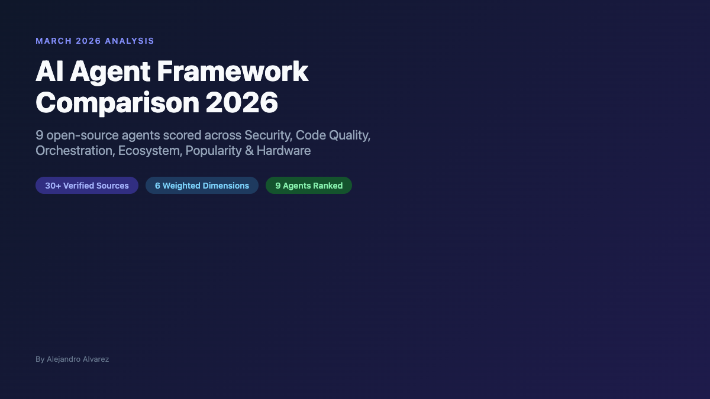
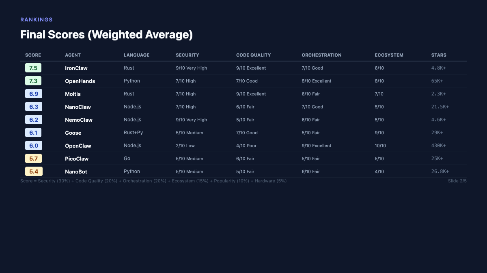
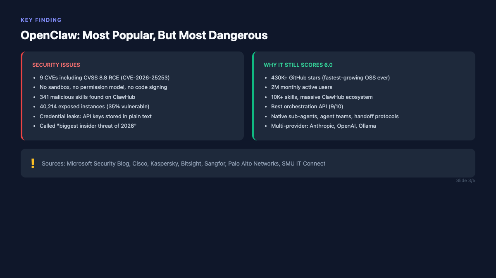
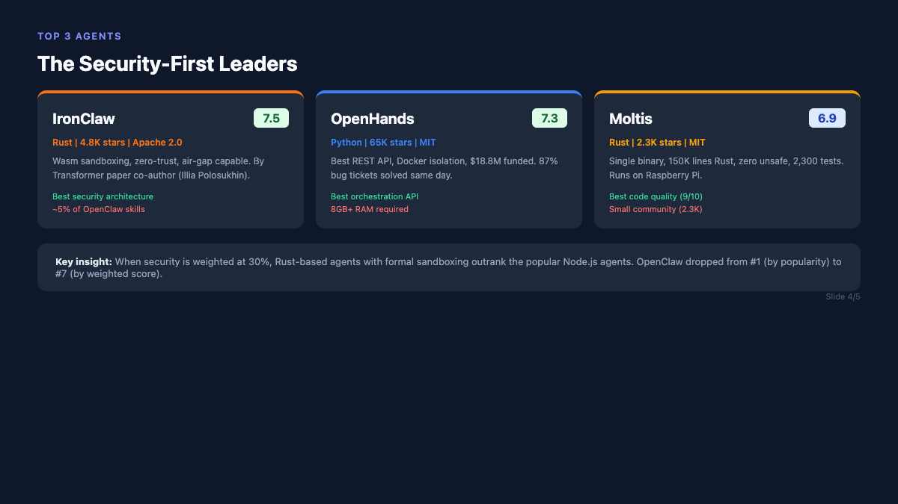
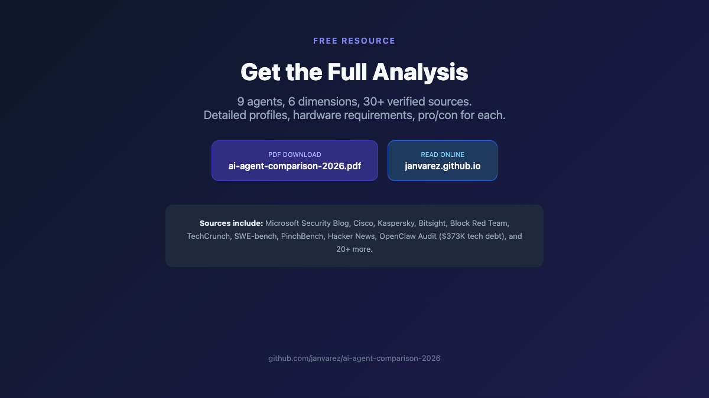

# AI Agent Framework Comparison 2026

Comprehensive analysis of 9 open-source AI agent frameworks scored across Security, Code Quality, Orchestration, Ecosystem, Popularity, and Hardware Efficiency.

## Rankings

| Score | Agent | Language | Security | Key Strength |
|-------|-------|----------|----------|-------------|
| **7.5** | IronClaw | Rust | Very High | Wasm sandboxing, zero-trust, air-gap capable |
| **7.3** | OpenHands | Python | High | Best REST API, Docker isolation, $18.8M funded |
| **6.9** | Moltis | Rust | High | Single binary, 150K Rust, zero unsafe, 2,300 tests |
| **6.3** | NanoClaw | Node.js | High | Container-per-session, Docker partnership |
| **6.2** | NemoClaw | Node.js | Very High | NVIDIA triple enforcement, PII router |
| **6.1** | Goose | Rust+Python | Medium | 3K+ MCP tools, Block backing |
| **6.0** | OpenClaw | Node.js | Low | Largest ecosystem (10K+ skills), 430K stars |
| **5.7** | PicoClaw | Go | Medium | 10MB RAM, runs on $5 hardware |
| **5.4** | NanoBot | Python | Medium | 4K lines, easiest to understand |

## Score Methodology

Weighted average of 6 dimensions:
- **Security** (30%): Sandboxing, CVEs, credential handling, audit results
- **Code Quality** (20%): Language safety, test coverage, tech debt
- **Orchestration** (20%): API programmability, session mgmt, sub-agents
- **Ecosystem** (15%): Tools, plugins, MCP, integrations
- **Popularity** (10%): Stars, community, media coverage
- **Hardware** (5%): Resource efficiency

## Read the Full Analysis

- **Online**: [janvarez.github.io/ai-agent-comparison-2026](https://janvarez.github.io/ai-agent-comparison-2026/)
- **PDF**: [Download](ai-agent-comparison-2026.pdf)

## Carousel Slides (LinkedIn)

| | | |
|---|---|---|
|  |  |  |
|  |  | |

## Sources

30+ verified sources including Microsoft Security Blog, Cisco, Kaspersky, Bitsight, Block Red Team (Operation Pale Fire), TechCrunch, SWE-bench, PinchBench, Hacker News, and academic papers. Full list in the document.

## License

This analysis is provided free for sharing and reference. Attribution appreciated.
